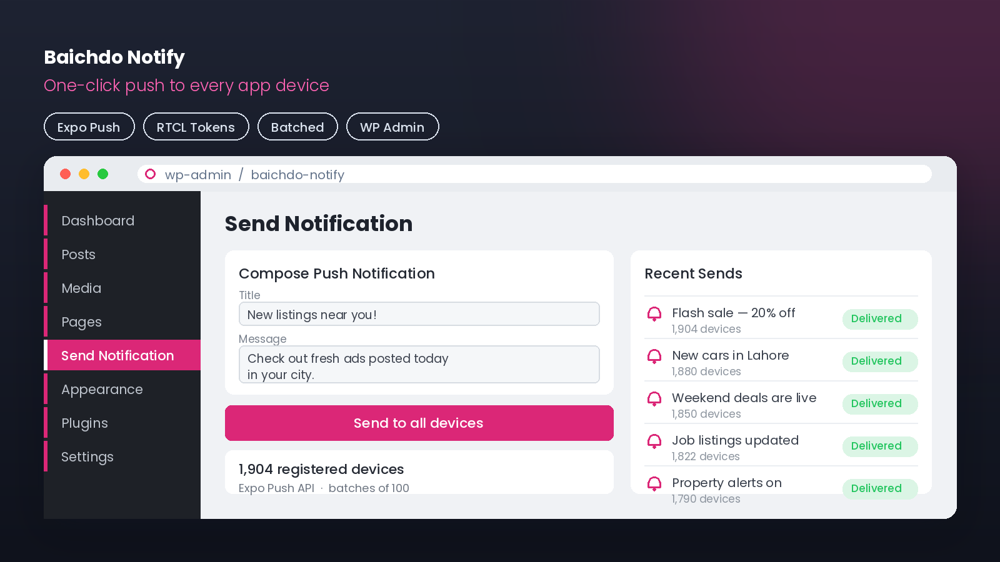
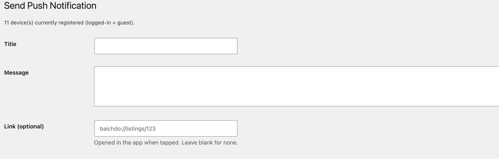
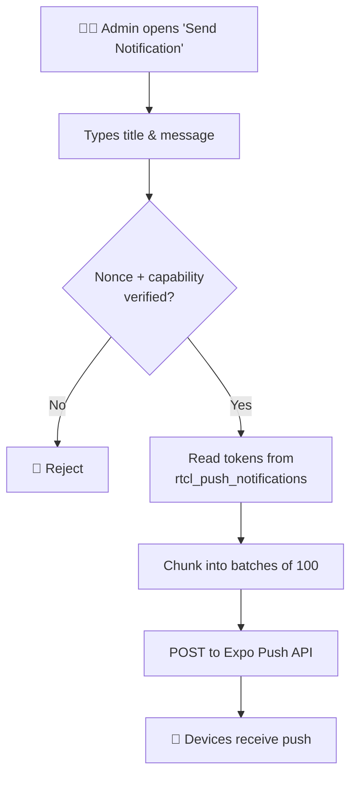

<div align="center">

# 🔔 Baichdo Notify

**A lightweight WordPress admin plugin that adds a "Send Notification" menu to push a message to every registered app device — reading RTCL's existing Expo push-token table.**

[](https://wordpress.org/)
[](https://wordpress.org/plugins/classified-listing/)
[](https://docs.expo.dev/push-notifications/overview/)
[](https://www.php.net/)
[](#)
[](#-license)

<br>



</div>

### 📸 Screenshots

<div align="center">
  
</div>

---

## 📖 Overview

**Baichdo Notify** adds a simple **"Send Notification"** page to the WordPress admin. From it you can broadcast an [Expo](https://docs.expo.dev/push-notifications/overview/) push notification to every device registered in your app — the plugin reads the existing `rtcl_push_notifications` token table (populated by the RTCL-based mobile app) and sends messages in batches through the Expo Push API.

> 💡 Purpose-built companion for the Baichdo mobile app — no separate dashboard or service required.

---

## ✨ Features

| Feature | Description |
|--------|-------------|
| 📣 **One-Click Broadcast** | Admin menu page to send a push to all devices |
| 🗂️ **Reads Existing Tokens** | Uses RTCL's `rtcl_push_notifications` table |
| 📦 **Batched Sending** | Sends in batches of 100 via the Expo Push API |
| 🔐 **Secure Admin Action** | Nonce-verified, `manage_options` capability gated |

---

## 🔄 How It Works



---

## 🚀 Installation

1. Copy the `baichdo-notify-menu` folder to `/wp-content/plugins/`.
2. Activate **Baichdo Notify** under **Plugins**.
3. A **Send Notification** item (megaphone icon) appears in the admin menu.
4. Enter a title and message, then send — it reaches every registered device.

> ℹ️ Requires the RTCL push-token table (`{prefix}_rtcl_push_notifications`) to be populated by your app.

---

## 📁 Project Structure

```
baichdo-notify-menu/
└── baichdo-notify.php     # Admin menu page + Expo push sender
```

---

## ⚙️ Technical Notes

- **Expo endpoint:** `https://exp.host/--/api/v2/push/send`
- **Batch size:** 100 tokens per request
- **Security:** WordPress nonce verification + `manage_options` capability check

---

## 📝 License

Released under the **GPL-2.0-or-later** license.

---

<div align="center">
<sub>By <b>Ahmed Faran</b> · Companion plugin for the Baichdo app</sub>
</div>
